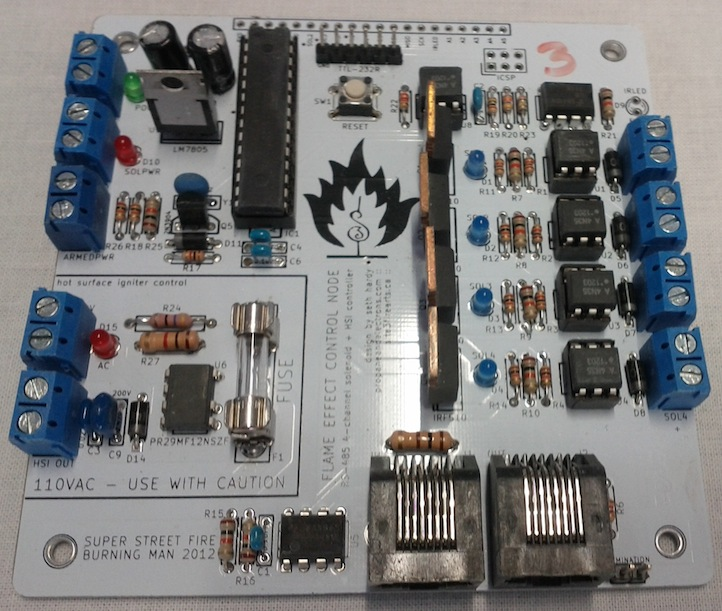

fenode
------
Flame effect control node: an Arduino compatible, 4 channel DC + 1 channel AC solid state relay with RS-485 communication and flame sensor built-in. Originally designed for and used by Super Street Fire.

4 DC channels and 1 AC channel makes this board very versatile. Use it to control flame effects with a hot surface igniter, or RGBW LEDs using the DMX512 protocol.

### Feature Summary

* Arduino compatible
* Programmable via 6-pin FTDI header or 6-pin ICSP header
* Four DC load channels switched via MOSFET
* One AC load channel switched via SSR
* Power connectors use 5mm screw terminals or Anderson Powerpole connectors
* Standard 5mm fuse for protection on AC channel
* RS-485 support (DMX512 compatible) via 8P8C connectors
* Termination resistor and jumper for serial connection
* All ATMega I/O pins are broken out on the board
* DC load power is optoisolated from the control system power
* Power connectors use 5mm screw terminals or Anderson Powerpole connectors
* Load power status is reported to the microcontroller via an optoisolated input pin
* Each output channel has a status LED for easy debugging
* IR LED connector for use as a flame sensor

### Documents

* [Schematic](docs/fenode-schematic.pdf)
* [Bill of Materials](docs/fenode-BOM.csv)